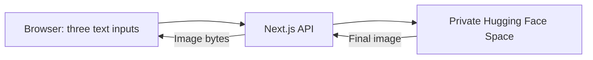

# SpeakCode

### A little link. A work of art.

A single-page AI QR art studio that turns a destination and a creative brief into
QR-inspired artwork. Built with **Next.js**, **React**, and **TypeScript**, with
image generation handled by a private **Hugging Face Space**.

<p align="center">
  
  <br />
  <sub>Illustrative example artwork. This image is not a scannable QR code.</sub>
</p>

## The experience

Start with a link, describe the image you imagine, and create your artwork.
The interface keeps the creative process focused on three text inputs.

- **Your destination** — the URL you want the QR code to open.
- **Your vision** — a prompt, with four optional style presets and inspiration suggestions.
- **What to leave out** — an optional negative prompt.

The studio includes a responsive layout, an enlarged image viewer, loading and
cancellation states, and clear error messages. The example is replaced only after
a successful generation; a failed request keeps the previous artwork visible.
Style presets only fill the prompt field.

> Always test a generated QR image with a phone and confirm the destination before
> using it. Successful image generation does not guarantee that the QR is readable.

## How it works



The browser calls the same-origin Next.js API. Authentication and private image
retrieval happen on the server. The browser receives image bytes and displays them
using a temporary object URL. This application does not persist generated images.

This repository contains the web studio and its server integration. The generation
service is separate and is not included. You can explore the interface without
credentials; live generation requires access to a compatible Space.

## Run locally

**Requirements:** Node.js 22.18+ and npm. Node.js 24 is used for local development.

1. Clone this repository and open its directory.
2. Install dependencies:

   ```bash
   npm ci
   npm run setup:hooks
   ```

3. Copy `.env.example` to `.env.local` if that file does not already exist.
   Set these **server configuration values**:

   | Variable      | Purpose                                                       |
   | ------------- | ------------------------------------------------------------- |
   | `HF_TOKEN`    | A Hugging Face token authorized to access your private Space. |
   | `HF_SPACE_ID` | Your Space identifier in `owner/space` format.                |

   Keep the real values in `.env.local`. Never prefix the token variable with
   `NEXT_PUBLIC_`. Restart the server after changing environment values.

4. Start the studio:

   ```bash
   npm run dev
   ```

Open [localhost:3000](http://localhost:3000).

For a production build:

```bash
npm run build
npm start
```

## API · three inputs

`POST /api/generate` accepts a JSON body with exactly this public contract:

| Field             | Type   | Requirement                                         |
| ----------------- | ------ | --------------------------------------------------- |
| `url`             | string | HTTP or HTTPS URL, up to 2,048 characters.          |
| `prompt`          | string | Non-empty description, up to 1,500 characters.      |
| `negative_prompt` | string | Up to 1,500 characters; use `""` to leave it empty. |

```json
{
  "url": "https://example.com",
  "prompt": "A lush botanical garden, soft natural light, viewed from above",
  "negative_prompt": "blurry, text, watermark"
}
```

Only these three fields are forwarded. Unknown fields are discarded. Requests
must originate from the studio and use `Content-Type: application/json`.

**Success:** final image bytes with a PNG, JPEG, or WebP content type.

**Failure:** a non-success HTTP status and a JSON `error` message; generation
failures also include a stable `code`. Raw upstream exceptions are not exposed.
Responses use `Cache-Control: no-store, private`.

A compatible Gradio Space must provide `/generate_simple` with these same three
named text inputs and return one final image. Credentials are supplied through the
server's pinned Gradio client; they are never part of the browser request body.

## Project structure

```text
src/
├── pages/index.tsx             # Studio interface and image viewer
├── app/api/generate/route.ts   # Server API and request validation
├── lib/generation.ts          # Shared three-field input contract
├── server/
│   ├── env.ts                 # Server configuration validation
│   ├── huggingface.ts         # Authenticated Space connection
│   └── generate-image.ts      # Job lifecycle and private image retrieval
└── styles/globals.css         # Responsive visual design
public/                        # Brand and example artwork
scripts/                       # Secret checks and API smoke checks
tests/                         # Contract, lifecycle, and security tests
```

The interface uses the Pages Router. The API uses a Node.js App Router Route
Handler so its integration modules can enforce the `server-only` boundary.

## Verification

| Command                      | Checks                                                                                 |
| ---------------------------- | -------------------------------------------------------------------------------------- |
| `npm test`                   | Input contract, mocked image retrieval, cancellation, timeouts, and secret protection. |
| `npx tsc --noEmit`           | TypeScript types.                                                                      |
| `npm run build`              | Secret scan and production build.                                                      |
| `npm run check:secrets`      | Git index and non-ignored working files.                                               |
| `npm run check:history`      | Reachable local Git history.                                                           |
| `node scripts/check-api.mjs` | API validation and response headers, with a local server on port 3000.                 |

Automated checks do not submit GPU jobs. Live generation depends on your Space's
availability, hardware, and quota, and must be verified separately.

## Privacy and deployment notes

- **Secrets stay local.** Environment files are ignored except for the blank-token
  example. Optional Git hooks check the index before commits and history before
  pushes. The scanners detect supported credential patterns, not every possible secret.
- **Private image handling.** The server accepts supported image formats up to
  10 MiB, checks file signatures, restricts retrieval to the configured Space's
  file endpoint, and refuses redirects.
- **Bounded requests.** Generation has a 240-second server deadline and a
  255-second browser deadline. The route requests a 300-second hosting duration;
  choose a host and plan that support it. Cancellation is best effort: an already
  running job may still finish. Requests are not automatically retried.
- **Public source is separate from public inference.** Before exposing the live
  service publicly, add authentication and a shared usage limit. The current
  same-origin checks and one-job-per-process guard are not a public usage-control system.
- **Image interactions.** Download buttons are omitted. Image context menus,
  dragging, and copy events are suppressed; mobile callouts are disabled where
  supported. Text selection and screenshots remain available. These measures
  discourage ordinary saving; they do not prevent retrieval through browser tools.

The interface can be reviewed independently of the private generation service.
